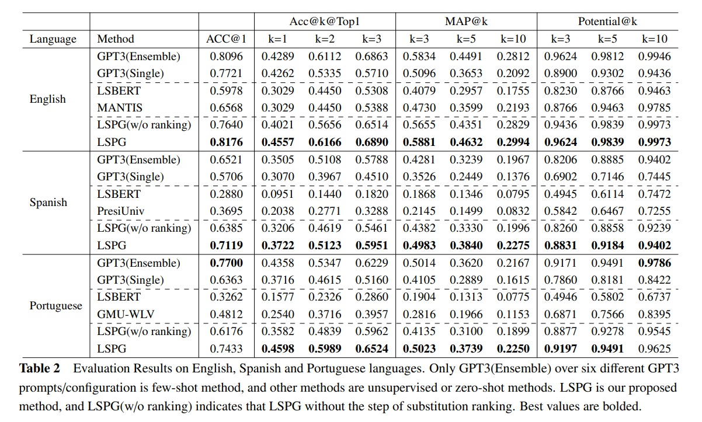

# LSPG :house_with_garden:
Implementation of our paper "Multilingual Lexical Simplification via Paraphrase
Generation"

# Dependencies&Installation
This project is mainly buld on [transformers](https://github.com/huggingface/transformers/tree/v4.20-release), with customized modification of scripts.To start, you need to clone this repo and install transformers firstly. Use the following pip command in transformers/:  
pip install -e . 

## Other dependencies
pip install -r requirements.txt


# Pretrained model
You need download the following pretrianed models and put them into folder model/  

[NLLB](https://huggingface.co/facebook/nllb-200-3.3B)  

[fastText embedding](https://fasttext.cc/docs/en/crawl-vectors.html)  

# How to run
## English
sh sh_EN_LS.sh  

## Spanish
sh sh_ES_LS.sh  

## Portuguese
sh sh_PT_LS.sh  

# Evaluation Scripts
Please refer [here](https://github.com/LaSTUS-TALN-UPF/TSAR-2022-Shared-Task)

# Results
Results on TSAR2022 multilingual LS shared task


# Futher Update
We will release our new LLM-based LS method PromLS soonly.

# Citation
<!-- Please cite as: -->
```
@inproceedings{liu-etal-2023-LSPG,
    title = "Multilingual Lexical Simplification via Paraphrase Generation",
    author = "Liu, Kang and Qiang, Jipeng and Li, Yun  and Yuan, Yunhao  and Zhu, Yi",
    booktitle = "ECAI",
    year = "2023"
    }
```
